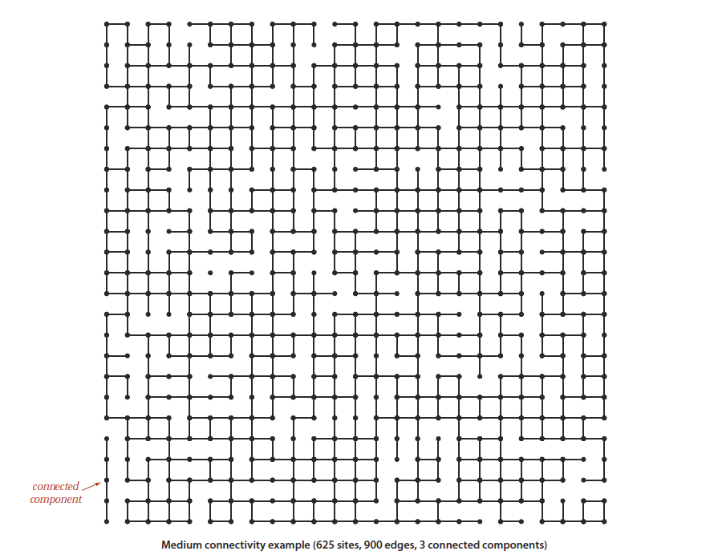
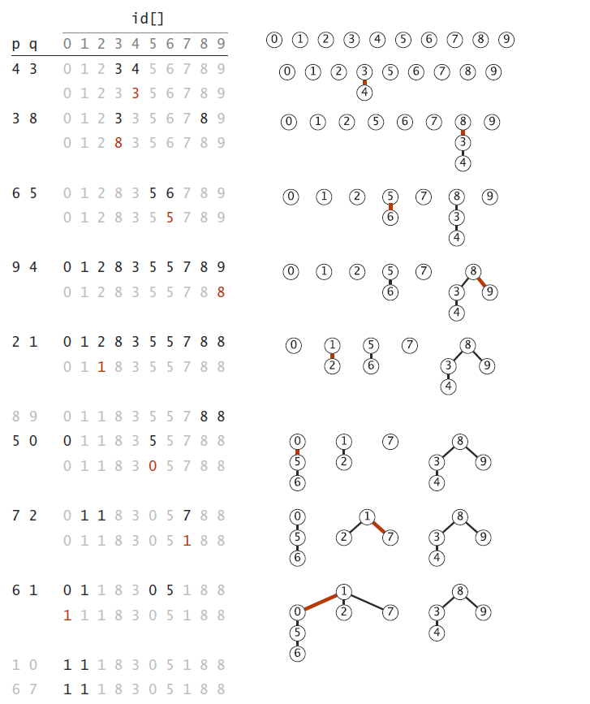

# 并查集 Union-Find
## 为何需要并查集
如下图所示，图中主要的元素包含节点和边，结点间有边相连代表联通。
考虑如何设计一种数据结构及算法，使得能够对节点施加 **合并（Union）** 和 **查询（Find）** 操作，使得能够在多个节点的图中执行连接和判断是否联通的操作。接口设计见下节。



题目应用示例：
[Leetcode 547: 朋友圈](https://leetcode-cn.com/problems/friend-circles/)

上题中可将每个人作为节点，朋友关系作为边，发现一个人和另一个人有朋友关系时，执行 **合并（Union）** 操作。对所有朋友信息遍历后，查询有多少个不同的联通的集合即可。（也即通过 **查询（Find）** 操作遍历每一个人的节点，记录有多少个不同的根节点。

下图更为清晰的展示了其中一种实现在执行`union(p, q)`后的结果。其中`id`数组用于记录对应节点的父节点，在同一棵树上的节点都是互相联通的：



## 接口设计
``` java
/* 构造器 */
UnionFind(int N)

/* 基本方法 */

// 查找节点p所属的根节点
int     find(int p)

// 合并节点p和节点q
void    union(int p, int q)

/* 以下为拓展接口，均可由上面的两个基本操作实现 */

// 判断是否是相连节点
boolean connected(int p, int q)

// 获取联通分量数目
int     count()
```

## 实现

### 1. 基本实现(quick-find)
```java
class Union {
    int parent[];
    int N;

    Union(int N) {
        this.parent = new int[N];
        this.N = N;
        for(int i = 0;i < N;i++) {
            parent[i] = -1;
        }
    }

    int find(int p) {
        if(parent[p] != -1) {
            return parent[p];
        } else {
            return p;
        }
    }

    void union(int p, int q) {
        pRoot = find(p);
        qRoot = find(q);

        if(qRoot != pRoot) {
            for(int i = 0;i < N;i++) {
                // 将所有属于qRoot的结点变为属于pRoot
                if(parent[i] == qRoot) {
                    parent[i] = pRoot;
                }
            }
        }
    }
}
```
### 2. 快速union(quick-union)
上面的实现里find操作很快，但union操作慢，这个实现提高union操作的速度。

```java
class Union {
    int parent[];
    int N;

    Union(int N) {
        this.parent = new int[N];
        this.N = N;
        for(int i = 0;i < N;i++) {
            parent[i] = -1;
        }
    }

    int find(int p) {
        int root = p;
        while(parent[root] != -1) {
            root = parent[root];
        }

        return root;
    }

    void union(int p, int q) {
        pRoot = find(p);
        qRoot = find(q);

        if(qRoot != pRoot) {
            // 将qRoot节点接在pRoot上，使得其所含节点全部与qRoot相关节点联通
            parent[qRoot] = pRoot;
        }
    }
}
```
### 3. 带权快速union(weighted quick-union)
上面的实现虽然使得union操作不再如1中需要固定的N次，但在数据很多时依然存在可能使得多次union后形成的树很高（比如将所有节点都union到一起，可能造成树的每一层只有一个节点，树的高度变为N）。故考虑在将两个树根节点连接时，根据两个根上已连接的节点数多少作为连接方法的选择依据：总将小树接到大树上。
```java
class Union {
    int parent[];
    int childCount[];
    int N;

    Union(int N) {
        this.parent = new int[N];
        this.childCount = new int[N];
        this.N = N;
        for(int i = 0;i < N;i++) {
            parent[i] = -1;
            childCount[i] = 1;
        }
    }

    int find(int p) {
        int root = p;
        while(parent[root] != -1) {
            root = parent[root];
        }

        return root;
    }

    void union(int p, int q) {
        pRoot = find(p);
        qRoot = find(q);

        if(qRoot != pRoot) {
            // 根据树根上已连接的节点数对如何连接进行选择，并更新树根连接的节点数数组
            if(childCount[qRoot] < childCount[pRoot]) {
                parent[qRoot] = pRoot;
                childCount[pRoot] += childCount[qRoot];
            } else {
                parent[pRoot] = qRoot;
                childCount[qRoot] += childCount[pRoot];
            }
        }
    }
}
```
### 4. 带权快速union且带路径压缩(weighted quick-union with path compression)
上面的实现已经可以保证O(logN)的时间复杂度了，但还可以有更好的实现。既然在find的过程中要不断向上查询直到找到根部，为何不考虑将每个子节点的父节点都设置为根节点呢？这样实现后可以使得find操作的时间复杂度进一步降低到接近常数级别。
```java
class Union {
    int parent[];
    int childCount[];
    int N;

    Union(int N) {
        this.parent = new int[N];
        this.childCount = new int[N];
        this.N = N;
        for(int i = 0;i < N;i++) {
            parent[i] = -1;
            childCount[i] = 1;
        }
    }

    int find(int p) {
        int root = p;
        while(parent[root] != -1) {
            root = parent[root];
        }

        int temp = p;
        // 路径压缩
        while(parent[temp] != -1) {
            int t = parent[temp];
            parent[temp] = root;
            temp = t;
        }

        return root;
    }

    void union(int p, int q) {
        pRoot = find(p);
        qRoot = find(q);

        if(qRoot != pRoot) {
            // 根据树根上已连接的节点数对如何连接进行选择，并更新树根连接的节点数数组
            if(childCount[qRoot] < childCount[pRoot]) {
                parent[qRoot] = pRoot;
                childCount[pRoot] += childCount[qRoot];
            } else {
                parent[pRoot] = qRoot;
                childCount[qRoot] += childCount[pRoot];
            }
        }
    }
}
```


